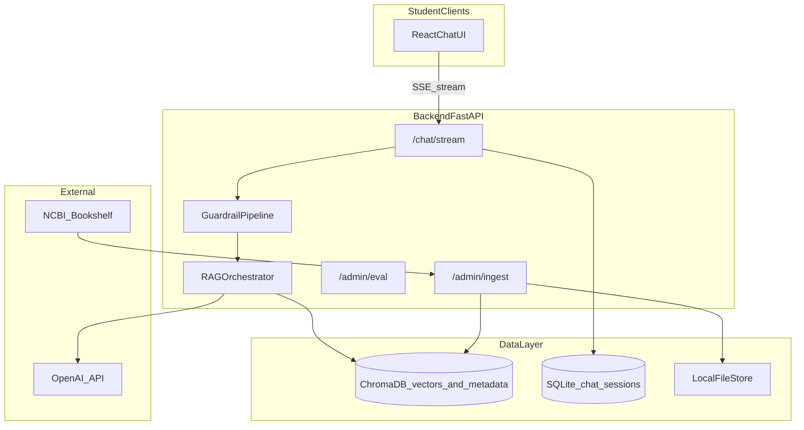
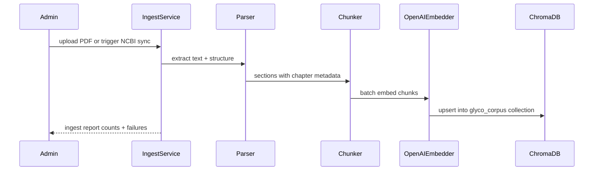
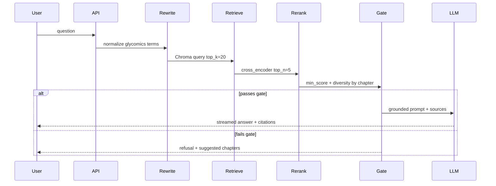
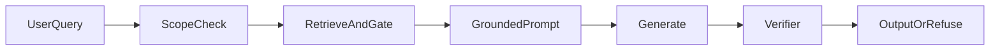

# GlycoChatbot — Architecture Plan

**Glycomics chatbot for GlyGen knowledgebase** — citation-first RAG prototype for students.

Based on `GlycoChatbot.pptx` and design choices: **local/dev first (prototype)**, **textbook + PDF RAG only**, **OpenAI API**, **ChromaDB for vectors**, **no Redis**.

---

## Implementation checklist

- [ ] Scaffold backend (FastAPI) + frontend (React/Vite) with ChromaDB (persistent local) and SQLite for sessions — no Redis
- [ ] Build NCBI Essentials of Glycobiology scraper/parser + PDF ingest with chapter/section metadata into ChromaDB via OpenAI embeddings
- [ ] Implement ChromaDB semantic retrieval + metadata filters, reranking, retrieval gate, and corpus versioning
- [ ] Add scope check, grounded system prompts, structured citations, post-answer verifier, and refusal paths
- [ ] Implement `POST /chat/stream` SSE endpoint with session/message persistence
- [ ] Build real-time chat UI with streaming, source panel, chapter links, and confidence badges
- [ ] Create glycomics question bank and automated eval for relevance, faithfulness, and chapter retrieval accuracy
- [ ] Add basic in-process rate limiting, admin auth for ingest, logging, and migration notes for pgvector/Redis when scaling beyond prototype

---

## 1. Goals (from PPT + requirements)

| Goal | Implementation |
|------|----------------|
| Domain glycomics Q&A via conversation | RAG over curated corpus only |
| Learn from *Essentials of Glycobiology* | Ingest NCBI book + instructor PDFs with chapter/section metadata |
| Reduce hallucinations | Retrieval gates + citation-required prompts + post-answer verification |
| Chapter-level references for students | Every answer returns chapter, section, page/snippet links |
| Real-time UI for many students | Streaming SSE chat + source panel |
| Evaluation | Question bank with gold chapter numbers + automated metrics |

---

## 2. High-Level Design (HLD)



### Component responsibilities

1. **Ingestion service** — Download/scrape NCBI book chapters, parse PDFs, chunk with rich metadata, embed, index.
2. **RAG orchestrator** — Query rewrite → semantic retrieval → rerank → context assembly → LLM answer.
3. **Guardrail pipeline** — Pre-check (scope), post-check (groundedness, citation match), refusal paths.
4. **Chat API** — Session management, streaming tokens, persist messages + retrieved sources.
5. **Student UI** — Chat + live citations + “open source excerpt” drawer.
6. **Evaluation module** — Run question bank, score relevance / faithfulness / chapter hit rate.

### Phased deployment (local → cloud)

| Phase | Scope |
|-------|--------|
| **Phase 1 (prototype — now)** | FastAPI + ChromaDB (persistent `./data/chroma`) + SQLite + React dev server; ingest book + PDFs; no Redis |
| **Phase 2 (pilot)** | Single VM; HTTPS reverse proxy; optional in-process rate limits; Chroma volume persisted on disk |
| **Phase 3 (scale)** | Migrate vectors to pgvector or Qdrant; add Redis cache; object storage (S3/Azure Blob); horizontal API replicas |

---

## 3. Low-Level Design (LLD)

### 3.1 Repository layout

```
glyco-chatbot/
├── backend/
│   ├── app/
│   │   ├── main.py                 # FastAPI entry
│   │   ├── api/routes/chat.py      # POST /chat/stream
│   │   ├── api/routes/ingest.py    # Admin ingest jobs
│   │   ├── api/routes/eval.py      # Evaluation runs
│   │   ├── rag/
│   │   │   ├── ingest.py           # PDF + NCBI parsers
│   │   │   ├── chunker.py          # Section-aware chunking
│   │   │   ├── embedder.py         # OpenAI embeddings
│   │   │   ├── retriever.py        # ChromaDB query + rerank
│   │   │   ├── chroma_store.py     # Chroma collection CRUD + metadata filters
│   │   │   └── generator.py        # Prompt + stream
│   │   ├── guardrails/
│   │   │   ├── scope.py            # In/out of domain
│   │   │   ├── retrieval_gate.py   # Min score / min chunks
│   │   │   └── verifier.py         # Claim vs source check
│   │   ├── models/                 # SQLite models for sessions/messages
│   │   └── prompts/                # Versioned prompt templates
│   └── tests/
├── frontend/
│   ├── src/
│   │   ├── components/Chat.tsx
│   │   ├── components/SourcePanel.tsx
│   │   └── hooks/useChatStream.ts
│   └── package.json
├── data/
│   ├── chroma/                     # ChromaDB persistent storage
│   ├── chat.db                     # SQLite session/message store
│   ├── raw/                        # PDFs, downloaded book HTML
│   ├── processed/                  # Chunks JSONL (backup/audit)
│   └── eval/question_bank.jsonl    # Gold Q/A + chapter
└── scripts/ingest_book.py
```

### 3.2 Data model (ChromaDB + SQLite)

**ChromaDB collection: `glyco_corpus`**

Each chunk is one Chroma document:

- `id` — stable chunk UUID
- `document` — chunk text
- `embedding` — OpenAI `text-embedding-3-small` (1536-dim)
- `metadata`:
  - `document_id`, `source_type` (`ncbi_book` | `pdf`), `title`
  - `chapter_num`, `chapter_title`, `section_title`
  - `page_num`, `ncbi_url`, `anchor_id`
  - `corpus_version`, `ingested_at`

Chroma handles vector ANN search and metadata filtering (`where={"chapter_num": 14}`).

**SQLite (chat history only)**

- **`chat_sessions`** — `id`, `created_at`
- **`messages`** — `id`, `session_id`, `role`, `content`, `citations JSON`, `retrieval_scores JSON`, `guardrail_flags JSON`, `chunk_ids JSON`

**Why split stores for prototype**

- ChromaDB: fast to stand up, embeds + metadata in one place, zero extra services.
- SQLite: lightweight persistence for chat logs without running Postgres.
- No Redis: skip caching and distributed rate limits until pilot traffic justifies it.

### 3.3 Ingestion pipeline (LLD)



**NCBI book ingestion**

- Fetch chapter pages from [Essentials of Glycobiology](https://www.ncbi.nlm.nih.gov/books/NBK579918/) (HTML per chapter).
- Parse headings → map to `chapter_num` / `section_title`.
- Store canonical `ncbi_url` per chunk for student “open reference” links.

**PDF ingestion**

- Use `PyMuPDF` or `unstructured` for text + page numbers.
- If PDF has TOC/bookmarks, use them for chapter mapping; else heuristic heading detection + manual correction CSV for bad PDFs.

**Chunking rules (critical for chapter retrieval metric)**

- Target **400–800 tokens** with **80–120 token overlap**.
- Never split mid-paragraph when possible.
- Attach metadata at chunk time (do not infer chapter in the LLM at answer time).

### 3.4 Retrieval pipeline (LLD)



**Steps**

1. **Query rewrite** — Expand abbreviations (e.g. GlcNAc, SNFG); optional HyDE only for vague queries (trade-off: can add noise).
2. **Semantic retrieval (ChromaDB)** — `collection.query(query_embeddings=..., n_results=20, where=optional_filters)`; distance → similarity score.
3. **Optional keyword boost (prototype-light)** — Re-score top 20 by simple token overlap on chunk text (no separate FTS engine); defer full hybrid (BM25) to Phase 3 migration.
4. **Rerank** — `bge-reranker-base` locally or OpenAI-based rerank; keeps best 5 chunks.
5. **Diversity** — Max 2 chunks per chapter to avoid one-chapter bias.
6. **Retrieval gate** — If top score < threshold OR < 2 chunks above floor → **no LLM answer**; return “Not found in course materials” + top chapter suggestions.

### 3.5 Chat API contract

**`POST /api/v1/chat/stream`** (SSE)

Request:

```json
{
  "session_id": "uuid-or-null",
  "message": "What is the glycocalyx?",
  "filters": { "source_types": ["ncbi_book", "pdf"] }
}
```

Stream events:

- `token` — partial assistant text
- `sources` — retrieved chunks with scores + URLs
- `done` — final message id + guardrail status
- `error` — structured error

**`GET /api/v1/sessions/{id}/messages`** — history for UI reload.

### 3.6 Real-time student UI (LLD)

**Stack:** React + Vite + Tailwind.

**UX requirements**

- Streaming assistant bubble (typewriter effect via SSE).
- **Source panel** (right side / collapsible on mobile): chapter number, section, excerpt, link to NCBI page or PDF page.
- “Confidence” badge: `Grounded` | `Partially grounded` | `Insufficient sources` (from guardrails).
- Suggested starter questions from eval/question bank categories.
- Session persisted in `localStorage` + server session id.

**Concurrency note for “many students”**

- Prototype: single FastAPI process handles ~10–20 concurrent students; Chroma persistent client is file-backed (one writer at a time — fine for demo/pilot).
- Phase 3: migrate to pgvector/Qdrant + Redis cache + multiple Uvicorn workers when concurrency or corpus size grows.

---

## 4. Database and storage trade-offs

### 4.1 Vector store

| Option | Pros | Cons | Prototype choice |
|--------|------|------|------------------|
| **ChromaDB** | Zero infra; embeds + metadata + ANN in one API; persistent local dir; Python-native | Not ideal for high concurrency; no native BM25 hybrid; migration needed at scale | **Use now (prototype)** |
| **PostgreSQL + pgvector** | One DB for vectors + metadata + chat logs; full FTS hybrid | Extra service to run for a prototype | **Phase 3 migration target** |
| **Qdrant** | Fast ANN, good filters | Second system to operate | If retrieval latency becomes bottleneck |
| **Pinecone / Weaviate Cloud** | Managed scale | Cost, vendor lock-in | Phase 3 if university allows SaaS |

**Prototype choice:** **ChromaDB** — fastest path to a working RAG demo with chapter metadata filters. Wrap access in `chroma_store.py` so migration to pgvector/Qdrant later is a swap, not a rewrite.

**ChromaDB prototype config**

- `chromadb.PersistentClient(path="./data/chroma")`
- Single collection `glyco_corpus`; recreate or upsert on re-ingest with `corpus_version` bump
- Use `where` filters for `source_type`, `chapter_num` when student asks chapter-specific questions

### 4.2 Session / chat store

| Option | Pros | Cons | Prototype choice |
|--------|------|------|------------------|
| **SQLite** | Zero setup; file-backed; enough for prototype chat history | Weak under heavy concurrent writes | **Use now** |
| **PostgreSQL** | ACID, scales with pgvector co-location | Overkill for prototype | Phase 3 |
| **Frontend-only (localStorage)** | Simplest | No server-side eval/audit trail | Fallback only |

### 4.3 Cache (deferred for prototype)

| Option | Pros | Cons | Prototype choice |
|--------|------|------|------------------|
| **None** | Simplest stack | Repeated identical queries hit OpenAI each time | **Use now** |
| **In-memory LRU** | Free; cuts duplicate retrieval cost | Lost on restart; not shared across workers | Optional add if demo shows repeat queries |
| **Redis** | Shared cache + rate limits across workers | Extra container + ops | **Defer to Phase 3** |

### 4.4 Object / file storage

| Option | Pros | Cons | Recommendation |
|--------|------|------|----------------|
| **Local `./data/raw`** | Simple for dev | Not shared across machines | **Phase 1** |
| **S3 / Azure Blob** | Durable, versioned PDFs | Cost + IAM | **Phase 3** |

### 4.5 Embeddings model

| Option | Pros | Cons | Recommendation |
|--------|------|------|----------------|
| **OpenAI text-embedding-3-small** | Strong quality, easy | API cost, data leaves campus | **Matches OpenAI choice** |
| **OpenAI text-embedding-3-large** | Better retrieval | 3× cost | Use if eval shows recall gaps |
| **Local bge-large-en** | No embedding API cost | GPU/CPU load, ops | Consider if API budget tight |

### 4.6 LLM for answers

| Model | Pros | Cons | Recommendation |
|-------|------|------|----------------|
| **gpt-4o** | Best instruction following + grounding | Cost | **Default generator** |
| **gpt-4o-mini** | Cheap for rewrite/rerank helpers | Weaker on complex glycomics | Use for query rewrite only |
| **gpt-4.1** | Newer, strong reasoning | Availability/pricing varies | A/B in eval if accessible |

---

## 5. Anti-hallucination guardrails (defense in depth)



### Layer 1 — Scope gate (pre-retrieval)

- Classify: `in_corpus_glycomics` | `general_science` | `off_topic` | `unsafe`.
- Off-topic → refuse with message: *“I only answer from Essentials of Glycobiology and course PDFs.”*
- Implement with small prompt to **gpt-4o-mini** + keyword allowlist (glycan, glycoprotein, SNFG, etc.).

### Layer 2 — Retrieval gate (pre-generation)

- Require **≥ 2 chunks** with rerank score above threshold.
- Require **max score ≥ T_high** for factual claims; medium band → answer with “limited source coverage” disclaimer.
- If gate fails → **do not call main LLM** for synthesis; return suggested reading links only.

### Layer 3 — Grounded generation prompt

- System rules (versioned in `prompts/system_v1.txt`):
  - Answer **only** from provided `SOURCES`.
  - Every factual sentence must cite `[Source N]`.
  - If sources conflict or are insufficient, say **“Not stated clearly in the provided excerpts.”**
  - Never invent chapter numbers, pathways, or experimental results.
  - Prefer quoting short phrases from sources for definitions.

### Layer 4 — Structured output schema

Force JSON intermediate (internal) then render markdown:

```json
{
  "answer_markdown": "...",
  "citations": [{"source_id": 1, "chapter_num": 14, "quote": "..."}],
  "confidence": "high|medium|low",
  "missing_info": []
}
```

### Layer 5 — Post-generation verifier

- Extract atomic claims from answer.
- For each claim, check support in cited chunk (NLI-style prompt or embedding similarity claim↔chunk).
- If unsupported claims > 0 → downgrade to partial OR regenerate once with stricter temperature (0).
- Log `guardrail_flags` on every message for eval.

### Layer 6 — Student-visible transparency

- Show source excerpts used (not hidden chain-of-thought).
- Show chapter numbers as clickable references.
- Show badge when answer was **refused** vs **grounded**.

### Layer 7 — Operational guardrails

- **Corpus version pin** — Each answer stores `corpus_version` so citations stay reproducible after re-ingest.
- **Rate limiting (prototype)** — Simple in-process counter per IP in FastAPI middleware (e.g. 20 req/min); upgrade to Redis token bucket in Phase 3.
- **Max context** — Cap at 5 chunks to reduce “lost in the middle” hallucination.

---

## 6. Prompting strategy (concrete templates)

### System prompt (core)

```
You are GlycoChatbot, a tutor for glycobiology students.
You MUST answer using ONLY the numbered SOURCES below.
Rules:
1. Cite every factual statement as [Source N].
2. Include chapter and section when available.
3. If the answer is not in SOURCES, respond: "I could not find this in the course materials" and list the closest chapters.
4. Do not use prior knowledge not present in SOURCES.
5. Use clear undergraduate-level language.
6. For definitions, prefer a brief quote from the source.
```

### Query rewrite prompt (mini model)

```
Rewrite the student question for retrieval in a glycobiology textbook index.
Expand standard abbreviations. Output JSON: {"search_query": "...", "chapter_hint": null|number}
```

### Refusal template (retrieval gate failed)

```
I couldn't find enough matching content in Essentials of Glycobiology or the uploaded PDFs.
Try browsing: Chapter {suggested_chapters}.
You can rephrase using terms like: {keywords_from_query}.
```

**Prompt versioning:** Store `prompt_version` on each message; change prompts only via eval regression test.

---

## 7. Evaluation plan (from PPT slide 4)

### Question bank format (`data/eval/question_bank.jsonl`)

```json
{"id":"q001","question":"What is the glycocalyx?","gold_chapters":[10],"gold_answer":"...","difficulty":"easy"}
```

Build **50–100 questions** covering all major parts of the book + PDF-only content.

### Metrics

| Metric | How measured | Target (initial) |
|--------|--------------|------------------|
| **Answer relevance** | LLM-judge (gpt-4o) with rubric 1–5 vs gold answer | ≥ 4.0 avg |
| **Faithfulness / hallucination rate** | Claim-level support check against retrieved chunks | ≤ 5% unsupported claims |
| **Chapter retrieval accuracy** | Predicted chapter in citations ∩ gold chapters | ≥ 80% |
| **Refusal precision** | Out-of-corpus questions should refuse, not invent | ≥ 90% |
| **Latency p95** | End-to-end streamed first token | < 3s local, < 5s cloud |

Run eval via **`POST /admin/eval/run`** after each ingest or prompt change; block deploy if regression > 5%.

---

## 8. Security, privacy, and compliance

- **No training on student chats** — Disable OpenAI data retention in API settings where available.
- **Admin ingest routes** — Protect with API key / basic auth in pilot.
- **PDF licensing** — NCBI book is CC BY-NC-ND; respect non-commercial use; instructor PDFs must be cleared for upload.
- **Secrets** — `.env` for `OPENAI_API_KEY`, never committed.

---

## 9. Cost and ops trade-offs (rough)

Assumptions: 100 students, 10 questions/day, ~5 chunks × 600 tokens context.

| Item | Est. monthly |
|------|----------------|
| OpenAI chat (gpt-4o) | $150–400 depending on answer length |
| OpenAI embeddings (one-time ingest + re-ingest) | $5–20 per full corpus |
| Local dev infra | $0 |
| Small VM pilot | ~$40–80/mo |
| Managed cloud Phase 3 | $200–600/mo (DB + VM + storage) |

**Cost levers:** use mini for rewrite/verify; lower `top_n` chunks; gpt-4o-mini for easy factual Q&A after eval confirms quality; add Redis/in-memory cache later if repeat queries dominate.

---

## 10. Implementation sequence

### Sprint 1 — Foundation (week 1)

- FastAPI skeleton + ChromaDB persistent client + SQLite for sessions.
- NCBI book ingest script + 1 PDF ingest into `glyco_corpus`.
- Semantic retrieval + metadata filters working in CLI.

### Sprint 2 — RAG + guardrails (week 2)

- Retrieval gate + grounded prompts + SSE streaming endpoint.
- Verifier + citation JSON on messages.
- Unit tests for chunk metadata and gate thresholds.

### Sprint 3 — Student UI (week 3)

- React chat with streaming + source panel + mobile layout.
- Session history + starter questions.

### Sprint 4 — Evaluation + hardening (week 4)

- Question bank + eval runner + dashboard JSON report.
- In-process rate limits, logging, corpus versioning.
- Pilot with 5–10 students; tune thresholds from metrics.
- Document migration path: ChromaDB → pgvector, SQLite → Postgres, add Redis when scaling.

---

## 11. Key architectural trade-off summary

| Decision | Pick (prototype) | Why | Trade-off accepted |
|----------|------------------|-----|-------------------|
| Vector DB | **ChromaDB** | Fastest prototype; metadata filters built-in | Re-ingest/migrate later; weaker hybrid search vs pgvector+FTS |
| Chat store | **SQLite** | No extra services | Concurrent write limits; migrate to Postgres later |
| Cache | **None** | Simpler stack for demo | Duplicate queries cost more OpenAI tokens |
| LLM | OpenAI gpt-4o | Best grounding behavior for students | API cost + data sent to OpenAI |
| Scope | Book + PDF only (no GlyGen API) | Matches PPT primary source; simpler | No live glycan structure lookup |
| Refusal vs guess | Prefer refusal | Lower hallucination risk | Some valid questions may need rephrase |
| Streaming UI | SSE | Simple, real-time feel | SSE less bi-directional than WebSocket (fine for chat) |
| Keyword recall | Light token overlap re-score | Good enough for prototype without FTS | Full BM25 hybrid deferred to Phase 3 |

---

## 12. Future extensions (out of initial scope)

- **Scale migration:** ChromaDB → pgvector or Qdrant; SQLite → Postgres; add Redis for cache + distributed rate limits.
- GlyGen API tool calls for glycan/protein lookup (hybrid RAG + structured API).
- Full hybrid search (vector + BM25) when enzyme/glycan exact-term recall gaps show up in eval.
- Instructor dashboard: view common student questions + weak chapters.
- Multilingual support (if international students).
- Fine-tuned reranker on glycomics query/chunk pairs.
