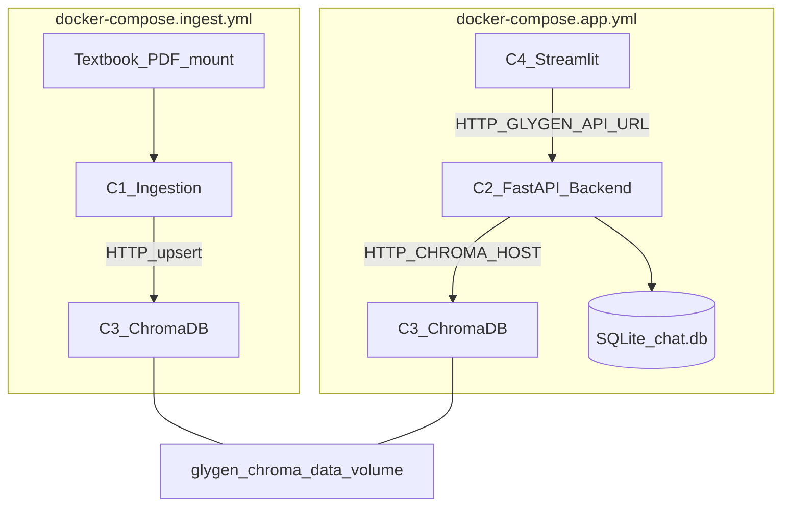
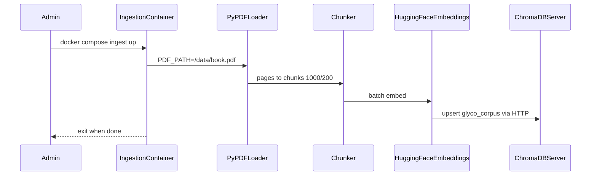
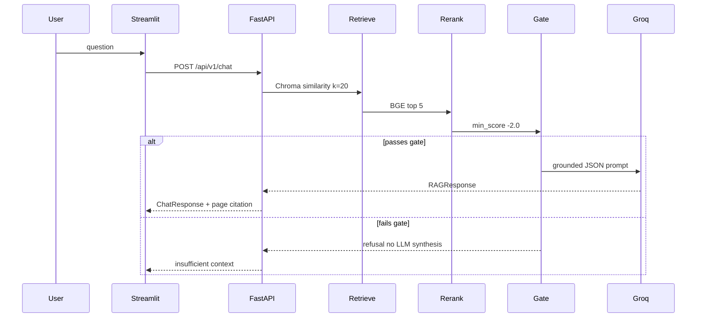
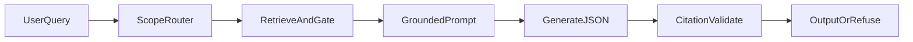

# GlyGen AI Chatbot — Architecture Plan

**Citation-first RAG chatbot for glycobiology students**, built over *Essentials of Glycobiology, Fourth Edition*.

**Version:** 0.2.0 (Dockerized prototype)

**Stack (as built):** FastAPI backend, Streamlit UI (HTTP client), ChromaDB (HTTP server in Docker / embedded locally), SQLite sessions, HuggingFace embeddings + BGE reranker, Groq LLM (`llama-3.1-8b-instant`).

---

## Implementation checklist

### Done

- [x] FastAPI backend with session persistence (SQLite)
- [x] PDF ingest → chunk → embed → Chroma collection `glyco_corpus`
- [x] Semantic retrieval + BGE reranking + retrieval gate + grounded JSON prompts
- [x] Streamlit chat UI calling FastAPI over HTTP (`api/http_client.py`)
- [x] Chroma HTTP client for Docker (`retrieval/chroma_client.py`); embedded mode for local
- [x] Four containers + two Compose files (ingest vs app)
- [x] README with local and Docker runbooks

### Not done (future)

- [ ] React/Vite frontend with SSE streaming (`POST /chat/stream`)
- [ ] NCBI Essentials of Glycobiology scraper + chapter/section metadata
- [ ] Post-answer claim-level verifier (beyond citation ID checks)
- [ ] Glycomics question bank + automated eval (relevance, faithfulness, chapter hit rate)
- [ ] Rate limiting, admin auth for ingest, CI/CD
- [ ] Migration notes / cutover to pgvector or Qdrant + Redis at scale

---

## 1. Goals

| Goal | Implementation |
|------|----------------|
| Domain glycomics Q&A via conversation | RAG over curated textbook corpus only |
| Learn from *Essentials of Glycobiology* | PDF ingest with page metadata into ChromaDB |
| Reduce hallucinations | Retrieval gate + citation-required prompts + source ID validation |
| Page-level references for students | Answers include textbook page citation footer |
| Separable ingest vs runtime | Two Docker Compose files |
| Portable deployment | 4 containers: Ingestion, Backend, ChromaDB, Streamlit |

---

## 2. High-Level Design (HLD)



### Container map

| ID | Service | Compose file | Role |
|----|---------|--------------|------|
| **C1** | `ingestion` | `docker-compose.ingest.yml` | One-shot PDF → embed → Chroma; exits when done |
| **C2** | `backend` | `docker-compose.app.yml` | FastAPI + `ChatOrchestrator` + RAG + SQLite |
| **C3** | `chromadb` | both | Vector DB server (`chromadb/chroma:0.6.3`) |
| **C4** | `streamlit` | `docker-compose.app.yml` | Chat UI; calls backend via HTTP |

### Component responsibilities

1. **Ingestion service** — Load PDF, chunk, embed, upsert into Chroma over HTTP.
2. **RAG orchestrator** — Query normalize → retrieve → rerank → gate → grounded LLM answer.
3. **Chat API** — Session management, chat endpoint, persist messages + citations.
4. **Streamlit UI** — Chat + session sidebar; no in-process RAG (HTTP only).
5. **ChromaDB** — Persistent vector store shared via named volume `glygen_chroma_data`.

### Phased deployment

| Phase | Scope | Status |
|-------|--------|--------|
| **Phase 1a (local)** | uvicorn + Streamlit + embedded Chroma (`data/chroma`) | Working |
| **Phase 1b (Docker prototype)** | 4 containers, 2 compose files | **Current** |
| **Phase 2 (pilot)** | Single VM; HTTPS reverse proxy; optional rate limits | Not started |
| **Phase 3 (scale)** | pgvector/Qdrant; Redis; object storage; API replicas | Not started |

---

## 3. Low-Level Design (LLD)

### 3.1 Repository layout

```
Glygen-AI-CHatbot/
├── docker/
│   ├── Dockerfile.app               # Backend + ingestion image
│   └── Dockerfile.streamlit         # Lightweight Streamlit image
├── docker-compose.ingest.yml        # C1 + C3
├── docker-compose.app.yml           # C2 + C3 + C4
├── .dockerignore
├── .env.example
├── README.md
├── plan.md
├── main.py                          # CLI one-shot RAG (no sessions)
├── requirements.txt
├── pyproject.toml
├── data/                            # Local-only (embedded chroma / chat.db)
└── src/glygen-chatbot/
    ├── Ingestion/                   # PDF load, chunk, embed, store
    ├── retrieval/
    │   ├── chroma_client.py         # HTTP or embedded Chroma
    │   ├── chroma_store.py
    │   ├── retriever.py
    │   ├── reranker.py
    │   └── gate.py
    ├── query/                       # RAGConfig, query processor
    ├── generation/                  # prompts, Groq generator, schemas
    ├── RAG/pipeline.py              # End-to-end ask()
    ├── session/                     # SQLite store, router, memory
    └── api/
        ├── server.py                # FastAPI entry
        ├── orchestrator.py          # Chat routing + persistence
        ├── http_client.py           # Streamlit → API client
        ├── streamlit_app.py
        ├── schemas.py
        └── routes/                  # health, status, sessions, chat
```

### 3.2 Data model

**ChromaDB collection: `glyco_corpus`**

- Document text = chunk content
- Embedding = HuggingFace `sentence-transformers/all-MiniLM-L6-v2` (normalized)
- Metadata (from PDF): `page`, `page_label`, `source`, title/author when present

**Docker:** Chroma runs as a server; clients use `CHROMA_HOST` / `CHROMA_PORT`.  
**Local (no Docker):** omit `CHROMA_HOST` → embedded `persist_directory` under `data/chroma`.

**SQLite (chat history only)** — path from `DATA_DIR` (default `data/chat.db`):

- **`chat_sessions`** — `id`, `created_at`, `user_display_name`
- **`messages`** — `id`, `session_id`, `role`, `content`, `question_type`, `citations_json`, `created_at`

**Why split stores**

- ChromaDB: vectors + chunk text for RAG
- SQLite: sessions/messages without Postgres
- Shared volume `glygen_chroma_data` so ingest and app see the same index

### 3.3 Ingestion pipeline (LLD)



**Chunking**

- `chunk_size=1000`, `chunk_overlap=200`
- Separators: `\n\n`, `\n`, `. `, ` `, `""`

**Observed scale (notebook / prior runs)**

- ~1,329 pages → ~3,656 chunks

### 3.4 Retrieval / RAG pipeline (LLD)



**Steps**

1. Query normalize (whitespace)
2. Optional follow-up enrichment from last textbook question
3. Dense retrieval `top_k_retrieval=20`
4. Cross-encoder rerank `BAAI/bge-reranker-base` → `top_k_rerank=5`
5. Retrieval gate: top score ≥ `min_rerank_score` (-2.0)
6. Context blocks `[SOURCE N | page_index=... | page_label=...]`
7. Groq generation → JSON `RAGResponse` → validate `source_id`

**Not implemented yet:** BM25 hybrid, chapter metadata filters, HyDE rewrite, SSE streaming.

### 3.5 Chat API contract

**`POST /api/v1/chat`**

Request:

```json
{
  "session_id": "uuid",
  "question": "What is the glycocalyx?"
}
```

Response includes `answer`, `question_type`, `confidence`, `in_scope`, `sources[]`, optional `refusal_reason`.

**Other endpoints**

| Method | Path | Purpose |
|--------|------|---------|
| `GET` | `/health` | `chroma_ready`, `database_ready` |
| `GET` | `/api/v1/status` | Models, collection, chroma host/dir |
| `POST` | `/api/v1/sessions` | Create session |
| `GET` | `/api/v1/sessions` | List sessions (Streamlit sidebar) |
| `GET` | `/api/v1/sessions/{id}/messages` | History |

### 3.6 Streamlit UI (LLD)

- Calls `GlygenApiClient` with `GLYGEN_API_URL` (Docker: `http://backend:8000`)
- Sidebar: new chat + session list
- Chat: spinner while waiting for sync API response
- No local RAG models in the Streamlit image (lightweight Dockerfile)

### 3.7 Question routing

| Type | Examples | LLM? |
|------|----------|------|
| `textbook_rag` | Glycobiology questions / follow-ups | Yes |
| `session_name` | "My name is…" / "What's my name?" | No |
| `session_recap` | "What did I ask?" | No |
| `out_of_scope` | Weather, code requests, etc. | No |

---

## 4. Docker design

### 4.1 Compose file 1 — ingest

**File:** `docker-compose.ingest.yml`

| Service | Image / build | Notes |
|---------|---------------|--------|
| `chromadb` | `chromadb/chroma:0.6.3` | Port host `8001` → container `8000` |
| `ingestion` | `docker/Dockerfile.app` | `python -m Ingestion.pipeline`; `restart: "no"` |

Env: `HF_TOKEN`, `CHROMA_HOST=chromadb`, `CHROMA_PORT=8000`, `PDF_PATH=/data/book.pdf`  
Volume: PDF mount from project root; `glygen_chroma_data`; `hf_cache`

### 4.2 Compose file 2 — app

**File:** `docker-compose.app.yml`

| Service | Image / build | Ports |
|---------|---------------|-------|
| `chromadb` | same image + `glygen_chroma_data` | `8001:8000` |
| `backend` | `docker/Dockerfile.app` | `8000:8000` |
| `streamlit` | `docker/Dockerfile.streamlit` | `8501:8501` |

Env (backend): `HF_TOKEN`, `GROQ_API_KEY`, `CHROMA_HOST`, `CHROMA_PORT`, `DATA_DIR=/app/data`  
Env (streamlit): `GLYGEN_API_URL=http://backend:8000`  
Volumes: `glygen_chroma_data`, `chat_data`, `hf_cache`

### 4.3 Runbook

```bash
# Prerequisites: Docker Desktop, .env with HF_TOKEN + GROQ_API_KEY,
# PDF at project root: Essential_of_Glycobiology_4E_EPUB_V5_InterVenn.pdf

docker compose -f docker-compose.ingest.yml up --build
docker compose -f docker-compose.app.yml up --build

# Streamlit  http://localhost:8501
# Backend    http://localhost:8000
# Chroma     http://localhost:8001
```

Re-ingest after PDF change:

```bash
docker compose -f docker-compose.ingest.yml up ingestion --build
```

### 4.4 Environment variables

| Variable | Required | Used by | Purpose |
|----------|----------|---------|---------|
| `HF_TOKEN` | Yes | Ingestion, Backend | HuggingFace models |
| `GROQ_API_KEY` | Yes | Backend | LLM |
| `CHROMA_HOST` / `CHROMA_PORT` | Docker | Ingestion, Backend | Chroma HTTP |
| `PDF_PATH` | Docker ingest | Ingestion | PDF path in container |
| `DATA_DIR` | Docker app | Backend | SQLite / data root |
| `GLYGEN_API_URL` | Streamlit | UI | Backend base URL |

---

## 5. Storage and model trade-offs

### 5.1 Vector store

| Option | Prototype choice |
|--------|------------------|
| **ChromaDB server (Docker)** | **Use now** — shared volume, HTTP clients |
| Embedded Chroma (`data/chroma`) | Local dev without Docker |
| pgvector / Qdrant | Phase 3 |

### 5.2 Session store

| Option | Choice |
|--------|--------|
| **SQLite** | **Use now** |
| PostgreSQL | Phase 3 |

### 5.3 Embeddings / LLM / reranker

| Role | Model |
|------|--------|
| Embeddings | `sentence-transformers/all-MiniLM-L6-v2` |
| Reranker | `BAAI/bge-reranker-base` |
| LLM | Groq `llama-3.1-8b-instant`, temperature `0.0` |

Original plan used OpenAI embeddings + GPT-4o; current prototype uses HuggingFace + Groq for cost and local embedding/rerank.

---

## 6. Anti-hallucination guardrails



| Layer | Status |
|-------|--------|
| Scope / question type router | Done (regex + keywords) |
| Retrieval gate | Done |
| Grounded system prompt | Done |
| Structured JSON output | Done |
| Citation `source_id` validation | Done |
| Claim-level NLI verifier | Not built |
| Rate limiting / corpus version pin | Not built |

**Refusal preference:** Prefer "not found in textbook" over guessing.

---

## 7. Prompting strategy

Persona: **GlyGen Tutor** — answer only from CONTEXT; JSON schema with `answer`, `confidence`, `in_scope`, single best `sources[]` entry, optional `refusal_reason`.

Display formatting appends:

```text
**Source:** *Essentials of Glycobiology*, Page {page_label}
```

---

## 8. Evaluation plan (designed, not built)

| Metric | Target (initial) |
|--------|------------------|
| Answer relevance (LLM-judge) | ≥ 4.0 avg |
| Faithfulness / unsupported claims | ≤ 5% |
| Chapter retrieval accuracy | ≥ 80% (needs chapter metadata first) |
| Refusal precision | ≥ 90% |
| Latency p95 | Tune after Docker baseline |

Question bank path (planned): `data/eval/question_bank.jsonl`.

---

## 9. Security and compliance

- Secrets in `.env` (gitignored); compose uses `env_file: .env`
- PDF licensing: respect NCBI / textbook non-commercial terms
- CORS currently open on FastAPI — tighten for pilot
- No admin auth on ingest yet — ingest is a local/Docker job, not a public API

---

## 10. Cost and ops (rough)

| Item | Notes |
|------|--------|
| Groq chat | Primary generation cost |
| HuggingFace models | Local in containers; cache via `hf_cache` volume |
| Docker Desktop | Local prototype infra |
| Pilot VM | Phase 2 |

---

## 11. Implementation sequence (status)

| Sprint | Deliverables | Status |
|--------|--------------|--------|
| Sprint 1 | FastAPI + Chroma + SQLite + PDF ingest + CLI | Done |
| Sprint 2 | Gate + grounded prompts + Streamlit + HTTP API split | Done |
| Sprint 3 | Docker 4 containers + 2 compose files | Done |
| Sprint 4 | Eval bank, streaming UI, chapter metadata, hardening | Not started |

---

## 12. Key architectural trade-offs

| Decision | Pick (current) | Why | Trade-off |
|----------|----------------|-----|-----------|
| Vector DB | ChromaDB (HTTP in Docker) | Fast prototype; shared volume | Migrate later for scale/hybrid |
| Chat store | SQLite | Zero extra services | Concurrent write limits |
| UI | Streamlit over HTTP | Matches 4-container split | Not React/SSE yet |
| LLM | Groq 8B | Cheap/fast | Weaker than gpt-4o on hard questions |
| Embeddings | Local MiniLM | No embedding API cost | Lower recall than large OpenAI embeds |
| Ingest vs app | Two compose files | Re-index without restarting UI | Operator must run ingest first |
| Refusal vs guess | Prefer refusal | Lower hallucination | Some valid Qs need rephrase |

---

## 13. Divergence from earlier plan drafts

| Earlier plan.md idea | Current reality |
|----------------------|-----------------|
| React + Vite + Tailwind | Streamlit |
| OpenAI embeddings + GPT-4o | HuggingFace + Groq |
| NCBI scraper + chapter metadata | PDF + page metadata only |
| SSE `/chat/stream` | Sync `/api/v1/chat` |
| Single local stack | Dockerized 4-service prototype |
| Streamlit in-process orchestrator | Streamlit → FastAPI HTTP |

---

## 14. Future extensions

- React UI with streaming + source panel
- NCBI Bookshelf ingest with chapter/section URLs
- Hybrid search (vector + BM25)
- Eval runner + regression gates
- GlyGen API tool calls (hybrid RAG + structured lookup)
- Instructor dashboard for common questions
- Phase 3: pgvector/Qdrant, Postgres, Redis, HTTPS pilot VM

---

## 15. PPT-oriented summary

1. Problem: LLMs hallucinate; students need textbook-grounded answers  
2. Solution: RAG + gate + citations  
3. Architecture: Streamlit → FastAPI → Chroma + SQLite  
4. Docker: C1 Ingestion, C2 Backend, C3 ChromaDB, C4 Streamlit  
5. Two compose files: ingest once, run app  
6. RAG steps: retrieve 20 → rerank 5 → gate → Groq JSON  
7. Guardrails and session routing  
8. Demo runbook and next steps (eval, chapters, streaming, scale)
